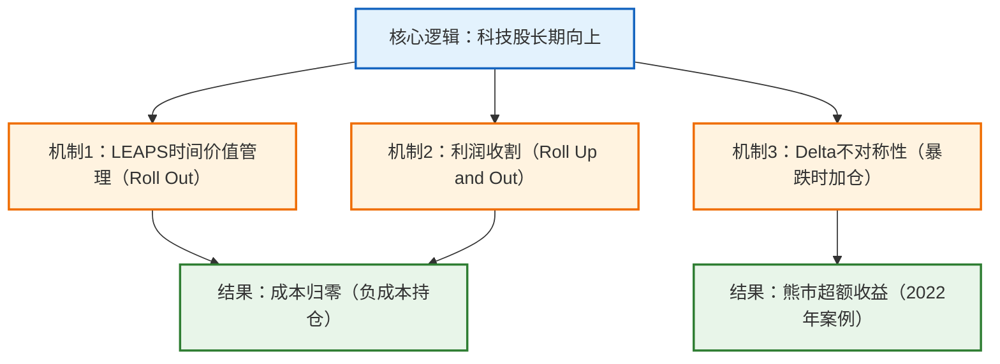

# $10万 到 $185万！LEAPS 期权“无限续杯”策略：如何把持仓成本Roll成负数？(10年回测)

## 首席金融分析师

### 1. 研报摘要
- **讲座主题**：LEAPS期权无限续杯策略量化回测与实战解析
- **核心判断**：通过LEAPS Call展期策略（Roll Out/Roll Up and Out）在QQQ上可实现年化31.1%收益，显著跑赢正股
- **置信度/情绪**：**强烈看多科技股长期走势**，但强调执行纪律与风险控制

### 2. 宏观传导机制

### 3. 资产配置观点

| 资产类别 | 观点 | 核心逻辑摘要 | 关注标的 |
| --- | --- | --- | --- |
| **纳斯达克指数（QQQ）** | 🟢 强烈看多 | 科技股长期增长+LEAPS杠杆效应 | 深度实值LEAPS Call（Delta 0.8） |
| **现金储备** | 🟡 战术配置 | 保留40%现金用于熊市加仓 | 短期国债（SHV） |
| **个股期权** | 🔴 谨慎 | 仅限流动性极强的大蓝筹（如TSLA） | 避免中概股/周期股 |

### 4. 关键数据与证据
* **回测收益**：2015-2025年10万→185万（年化31.1%），正股收益66万（年化18.5%）
* **关键操作节点**：2022年熊市累计加仓28张LEAPS，占总持仓89张的31%
* **期权参数**：Delta 0.8深度实值，到期日650-800天，下跌1%时建仓

### 5. 风险与不确定性
* **灰犀牛风险**：
  - 科技股长期增长假设被证伪（如AI技术泡沫破裂）
  - 美联储长期高利率压制估值
* **黑天鹅风险**：
  - QQQ成分股退市潮（类似2000年互联网泡沫）
  - 期权市场流动性枯竭（无法执行展期）
* **反向思考**：
  - 若策略失效：持续展期导致时间价值损耗超过标的上涨收益
  - 税务摩擦可能使实际收益降低30-40%

### 6. 操作备忘录
1. **现金管理**：初始60%期权+40%现金，熊市加仓分"重炮模式"（10%总仓位）和"标准模式"（5%）
2. **触发信号**：
   - Delta>0.9时Roll Up and Out收割利润
   - 剩余<300天时Roll Out续期
   - Delta<0.5且现金>10%时逆势加仓
3. **冷却机制**：加仓间隔≥30天，保留10%现金应对极端情况

*00:00:00 - 00:01:10*

如果在2015年给你10万美金买纳斯达克指数**QQQ**，到今天你能赚多少？大概是66万。但如果我告诉你，有一种策略，同样的10万美金起步，经历了2018年的暴跌、2020年的熔断，还有2022年的超级大熊市，账户余额却变成了185万美金。

最离谱的是，这笔持仓在第三年的时候，成本就已经变成了0，后面甚至变成了负数。也就是说，后面这7年的暴涨，完全是庄家在倒贴钱给你打工。这不是标题党，这是我耗时两周跑出来的**LEAPS期权**无限续杯量化回测测试结果，令我震惊。

其实有好多朋友买了LEAPS拿不住，或者倒在了黎明前，就是因为他们不会展期**roll**。今天这期视频我不卖关子，直接公开这套策略的具体玩法。我把手教会你具体该怎样去roll一张**SCO**，学会这一招你的**PSCO**技术就学完整了。

我是天哥，我用真实的LEAPS数据回测，证明给你看，就算不靠选股，也可以通过正确的投资体系跑赢大盘。说实话，我免费分享的内容比外面要价几千美金的课还扎实。所以如果你也喜欢像这样的干货，记得点赞订阅一下。那么废话不多说，let's go。

首先声明一下，本视频仅为个人的操作与策略分享，不构成任何投资建议。先给新观众快速补个课。

*00:01:10 - 00:01:15*

假设你想持有100股的**QQQ**，现在的价格大概需要花6万多美金，资金占用极大。

*00:01:15 - 00:02:00*

但是如果我们只买一张**QQQ**的**LEAPS Call**，选那些两年以后才到期、**Delta**在0.8左右的深度实值合约，你只需要花15000左右。因为Delta选了0.8，所以正股每涨1美金，这张期权的价值增加0.8美金。你用了1/4的钱达到了80%的持有效果，这就大大提高了资金使用率。这也是为什么**LEAPS**那么备受推崇的主要原因。

当然，LEAPS是有时效的，比如我们刚才说的那一张只有两年的期限。那么怎样才能让我们的期权长生不老呢？这就要讲到一个技术了，它就是展期（rollover），我也喜欢叫它滚动。其实就是由两个动作组成：卖出你手里旧的合约，再买入一张新的合约。

*00:02:00 - 00:03:12*

抛弃旧爱，拥抱新欢，就这么简单。很多人只有在做期权卖方的时候才做展期，其实我们买 **PSCO** 的时候也可以展期，而且相当爽。

今天这个策略主要会使用到两种展期技术，我们这里先快速解释一下：

第一种技术叫做 **Roll Out（向后滚）**。这就是简单的用来给**PSCO**续命的。当你的期权快到期的时候，时间价值会开始加速损耗。这时候不管盈亏，我们都要把手里的快到期的卖掉，去买一张更远期的。只要续约够及时，我们的**PSCO** 就会永垂不朽。

第二种技术叫做 **Roll Up and Out（向上向后滚）**。这招应用到**PSCO**上的时候，就是用来收割利润的。当**QQQ** 大涨，你手里的期权赚翻了，变得很贵。这个时候我们就把它高价卖掉，落袋为安，立刻去买一张行权价更高、到期日更远的新合约。因为行权价提高了，所以这张新合约的价格更便宜。这一卖一买，中间的价差就是我们盈利的现金。

我知道这个听起来很绕，我举个例子方便大家理解。

*00:03:12 - 00:03:56*

比如我有一张行权价100的QQQ期权，现在QQQ股价600整，那这100的看涨期权肯定非常值钱，光**内在价值**就已经有5万美金了。但这个时候我卖掉它，买入一张行权价在200的新合约。那内在价值就只有4万，你卖5万，然后再花4万买回，这不就赚了1万美金吗？

假如你最初买这张100行权价的QQQ成本是15000美金，你现在收回来了1万美金，那是不是成本就只剩下了5000美金了？所以只要你**展期**的次数足够多，收回来的现金超过了本金，你就实现了传说中的**零成本持仓**。

我把这套价值连城的量化逻辑浓缩成了这张流程图。来，我们从上往下看，首先是**回测**的初始设计。

*00:03:56 - 00:06:33*

假如我们有10万美金，我们使用黄金比例：60%买LEAPS，40%留现金。选什么？**只选QQQ**，我们不选个股，因为我们这个策略基于一个假设：美股大科技会继续像历史一样长期看涨。如果你不这么认为，那这个策略不适合你。

合约怎么选？到期日选650到800天的（也就是两年后到期的），Delta选0.8左右的深度实值。找一个QQQ当日下跌1%的时机就可以开始这个策略了。这40%的现金千万不要乱动，它很关键。

建仓完毕后，你只需要盯着三个信号，这三个信号分别对应市场的平淡、大涨和大跌：

1. **第一种情况：行情不错，稳步上涨**（对应中间绿色的利润收割分支）。当QQQ涨起来之后，你手里的合约Delta飙升到了0.9以上，这时你的期权已经跟正股没什么区别，资金利用率变低了。我们要贪婪地收割：操作动作是卖掉这张Delta 0.9的贵合约，买入一张更便宜的Delta 0.7左右的新合约，并且顺便把时间往后延。这一进一出，你会收到一笔现金差价，这笔钱就是市场奖励给你的分红，也是我们实现**零成本持仓**的关键。

2. **第二种情况：行情平淡，时间不断流逝**（对应左边紫色的无限续杯分支）。如果你手里的合约Delta一直没有涨到0.9，但剩余天数小于300天的时候，别犹豫，立刻执行Roll Out。虽然你需要花一点钱把合约延期到700天以后，但这个动作是为了防止时间价值出现断崖式下跌。

3. **第三种情况：熊市崩盘**（对应右边红色的逆势狙击板块）。当市场暴跌，只要有一张合约的Delta跌破了0.5，这时绝大多数散户都在割肉离场。而我们要干什么？我们不止损，因为有无限制续杯，这张期权会长生不老。我们耐心等它涨回来，并抄底买入更多QQQ LEAPS CALL期权。

这里我要引进一个**冷却期**的概念。这个冷却期是为了避免一次性把现金全用完。比如你一共有20张期权，如果现在全部处于Delta 0.5以下，因为有冷却期，我不会一次抄底20次。我们看一眼账户：如果你的现金储备大于10%，并且距离上次加仓已过30天的冷静期，就可以加仓了。

加仓的时候，我们有两个模式：
- 如果此时你手中的现金还非常多（比如大于40%仓位），我们进入**重炮模式**。

*00:06:33 - 00:07:43*

**泡模式**直接动用10%的总仓位的现金去买新合约，尽量把这10%的现金仓位用完。依然是开局那种两年期delta 0.8的QQQ call期权。这里多提一嘴，我说的10%不是现金仓位的10%，是总仓位的10%的现金。比如现在你的账户价值是100万，里面有50万的LEAPS期权，还有50万的现金，这里的10%用的是10万的现金，而不是50万现金仓位的10%（5万）。

如果现金消耗得差不多了，依然大于10%的仓位，但小于40%的仓位，我们就从**重炮模式**切换成**标准模式**，每次用5%的仓位的现金去买新合约。这就是为什么我们要留40%现金仓位的原因。在别人恐慌的时候，我们用极低的价格疯狂**吸筹**。等牛市一回来，这些低价筹码就是我们的财富金矿。

那如果现金仓位低于10%呢？我们不要做任何动作，因为需要留10%的现金仓位去给快到期的67天期权续杯。看懂了吗？这套系统很精密，时间不够了就续命，涨多了就提款，跌惨了就加仓。

*00:07:43 - 00:08:04*

你不需要去猜明天的涨跌，只需要像机器人一样严格执行这张图上的每一个指令：**不断购入廉价的LEAPS期权**，再把每一张的成本降为零，换成现金存起来等机会。最后测试周期：2015年1月1号到2025年。

*00:08:04 - 00:08:51*

12月20号，为什么要选这段周期？为了测试精准，我选用了conect平台来测试它的期权数据，这比我之前推算的历史波动率的期权数据要精准得多。但conect只有2012年以后的数据，因此我想测试过去1年，所以选了这个周期。  

这段周期也不简单，是非常不错的压力测试场。这期间我们经历了什么？**2018年的中美贸易战暴跌**，2020年的疫情四次熔断，还有2022年的美联储加息导致的史诗级长熊。这三次大回调，每一次都让普通散户爆仓离场。  

好了，朋友们，见证奇迹的时刻到了。如果2015年初你只是老老实实地买QQQ正股，拿着不动。

*00:08:51 - 00:09:25*

你的10万美金，今天会变成66万，其实也很不错，对吧？但是你看一眼我们的账户余额，185480618.5倍的回报，年化收益率达到了恐怖的31.1%。这是**QQQ**的3倍。

那么为什么这个策略可以打败QQQ正股这么多呢？秘密不在这几年的暴涨，而恰恰在于2022年的那场惨烈的熊市。来，我们打开后台的交易日志，我带大家看一眼我们的系统在那一年到底干了什么疯狂的事情。

大家看这里，2022年的6月28号，QQQ暴跌。

*00:09:25 - 00:10:13*

此时我们的现金仓位80%，**非常充足**。策略触发了avyat重炮加仓模式，我们一口气买入了6张PSCO一个月到期期权。冷却期后，7月29号又跌，再买了6张；8月29号还跌，继续买了6张。仅仅这5个月，在所有人都在割肉逃跑的时候，我们一口气吞下了28张廉价的QQQ LEAPS。这就是为什么到了最后，我们手里的合约总数能够达到惊人的89张。

大家注意一个细节：这套系统**非常聪明**。到了12月，因为疯狂抄底，我们的现金比例（CashRatio）跌破了40%。这时系统自动从重炮模式切回到了标准模式，只买了两张。看到这里，肯定有朋友会疑问：2022年跌得这么惨，我们手里的LEAPS都在亏钱，这时候还要掏钱去WIN ROLL续命？

*00:10:13 - 00:11:37*

这不是把钱往火坑里扔吗？  

**第一，你不是在买价格，你是在买时间**。LEAPS的本质是一张**入场券**，只要标的是QQQ（纳斯达克），只要人类科技不倒退，它迟早会创新高。这时候你花钱CO RollOut，不是在死扛，而是在给你的入场券续费。如果你不续费就会被踢出局，亏损就会永久锁死；如果你续费了，你就保留了翻盘的希望**。第二，这也是期权最迷人的一点，delta的不对称性。**我之前发过的QQQ视频，很多人问我QQQ期权和QQQ策略哪一个的收益会更好。我说我更喜欢QQQ期权，就是因为QQQ是线性的。在QQQ下跌的时候，QQQ是稳定的跌3倍。但是QQQ的期权因为有**伽瑪彈簧**保护，它的delta是不对称的：当它下跌的时候，delta跌到0.5，这个时候它就像是一根被压到极致的弹簧，再往下跌，它会亏得越来越慢。但是一旦QQQ开始反弹，哪怕只是反弹一点点，这根弹簧会瞬间爆发，delta会从0.5飙升回0.8。我们在底部囤积的那28张廉价的合约，一旦牛市回归，它的爆发力是正股的十几倍。  

但是观众朋友们，我必须强调一下，这套无限续费的玩法有一个绝对的前提：**你的标的物必须是长期向上的**。

*00:11:37 - 00:12:05*

比如像是**QQQ**或者**SPY**，尽量不要拿去跑个股。如果是大蓝筹，像英伟达、特斯拉这种还好，但如果你去roll阿里巴巴或者当年的雅虎，它有可能跌下去十年都回不来，或者直接退市。那么你不断地roll out，那就是不断地往无底洞里面扔钱，你会亏得很惨。最后我们看一看这个账户，本金10万开始，最后不仅变成了一。

*00:12:05 - 00:12:53*

85万，而且大家看这几行都是负数。这89张QQQ远期价内看涨期权的成本全部都是负的，这89张合约目前的总价值是1，136，981美金，成本是负的618，643美金。这意味着这些平均2027年才到期的优质合约，全部都是庄家倒贴钱送给我们的。这一刻，我们没有任何压力。

而且我们手上还拿着717，000.824美金的现金，就算熊市来了，这么厚的现金底子什么都不怕。最重要的是，这些**LEAPS**的杠杆效应都是极强的。之后QQQ继续往上涨，这些期权的回报简直恐怖，我都不敢想。

依照传统，我又要展示我正在进行的实盘测试了。

*00:12:53 - 00:13:32*

给大家看一眼我手里的这张特斯拉的实盘LEAPS。最开始我买入这张特斯拉的期权的时候，花了**15000美金**。这是我最初的成本。后来特斯拉涨了一波，我没有把它全部卖了止盈，因为我还是长期看好它。

我执行了刚才说的收割利润、roll out and up的操作：把旧合约卖了，换了一张行权价更高、时间更远的新合约，账户里瞬间收到了**2000美金**的现金。注意哦，这时候我的持仓还在，但是我已经把成本从15000降低到了13000。

这还没完。后来我还操作了一次的covered call，赚了**754美金**的权利金。

*00:13:32 - 00:13:40*

两周以后，我主动以67美金把它买回，前后又给我的成本下降了将近600美金。

*00:13:40 - 00:13:55*

大家看现在的状态，经过这一次**ROLL**加上一次**COVER CALL**，我的总持仓成本已经从最初的**15000美金**降到了现在的12313美金。虽然距离零成本还有很长的路要走，但这只是刚开始。只要特斯拉未来几年继续涨，我就继续**ROLL**。

*00:13:55 - 00:14:10*

总有一天成本会变成**0**。想要看天哥怎么把它的成本归零的朋友，请点赞订阅一波，我们一起见证。

*00:14:40 - 00:16:25*

最后，在大家兴奋地准备实盘之前，必须看清这个策略的三个硬伤。

**第一，执行压力**。看回撤曲线很容易，但身在其中是另一回事。回想一下2022年，当账户缩水了30%，每天打开软件都在亏钱。按照我们的策略，这个时候不仅不能止损，反而要动用最后的保密现金去疯狂加仓。在那种绝望的市场情绪下，你能不能克服恐惧，坚持执行加仓或Roll Up&Out的操作？如果你做不到，或者忍不住割肉离场，那么后面反转的暴利跟你一毛钱关系都没有。这套策略的门槛首先就是执行力。**第二，税务拖累**。提醒一下美股应税账户的朋友，你每次执行收割操作（也就是Roll Up&Out的时候），都是要先卖掉一张盈利的call，再买入一张新的call。如果这个操作不到一年，那就是短期资本利得。年底报税的时候，你收到的现金可能会被抽走一大部分税，这就会严重影响复利效应。当然，如果你使用的是免税账户，那就没有这个烦恼。我听说有些国家开美股账户买卖都不需要交税，这也许也是值得考虑的解决方案之一。所以这套策略在实盘里的回报肯定会因为税务打个不小的折扣，这点值得注意。**第三，买卖价差的损耗**。 也就是通常我们所谓的滑点损耗。虽然QQQ的流动性不错，但深度实值期权的流动性会差一点。所以玩这个策略必须有耐心，永远只用限价单挂在中间价慢慢等成交，急躁不得。

最后做个总结：这套**LEAPS无限续杯策略**，回测数据虽然跑出了十年18倍，但它并不是那种让你一夜暴富的魔法。

*00:16:25 - 00:17:26*

它需要时间启动，我们前期不断续杯，不断低位**吸筹**买入。如果更多PSCO不断收割，到了后期期权数量多起来之后，盈利速度会越来越快，而且都是零成本的。  

我这里测试的时间不够长，如果再长一点，我觉得还能让**年化回报率**变得更高。但我也要提醒大家，这个测试只是基于过去。过去的结果不能完全代表将来，大家也没有必要完全套用这个策略。  

这个策略第一是为了科普展期在PSCO里的用法，第二也是好玩，为了测试它在历史数据下的极限表现。其实大家可以像我一样，从一张PSCO开始玩起：涨了收割，快到期续约，跌了再买一张，玩一段时间感受一下。  

这个逻辑还是没有问题的，只要标的是长期上涨的，问题应该都不大。还有，这个策略最迷人的时刻，就是当你的**持仓成本归零**的那一刻。那一瞬间，我们就彻底赢了——你不是赢在了技术，而是赢在了心态，因为你玩的是庄家的钱，哪怕明天市场腰斩熔断。

*00:17:26 - 00:17:47*

你都能睡得安稳，不再为每天的波动焦虑，这才是交易的**最高境界**——财务与心态的双重自由。为了帮大家更好地落地，这期视频里面所有的回测代码、原始交易日志，还有那张高清的作战地图，我都已经打包整理好，放在了频道的SCO社区里。硬核的玩家可以自己下载下来，跑一下参数验证一下。

*00:17:47 - 00:18:11*

如果你觉得今天这期内容够干够硬，别忘了点个赞，顺便订阅**天哥富力之道**。我是天哥，用数据带你富力人生。感谢你今天的陪伴，我们下期节目再见。

